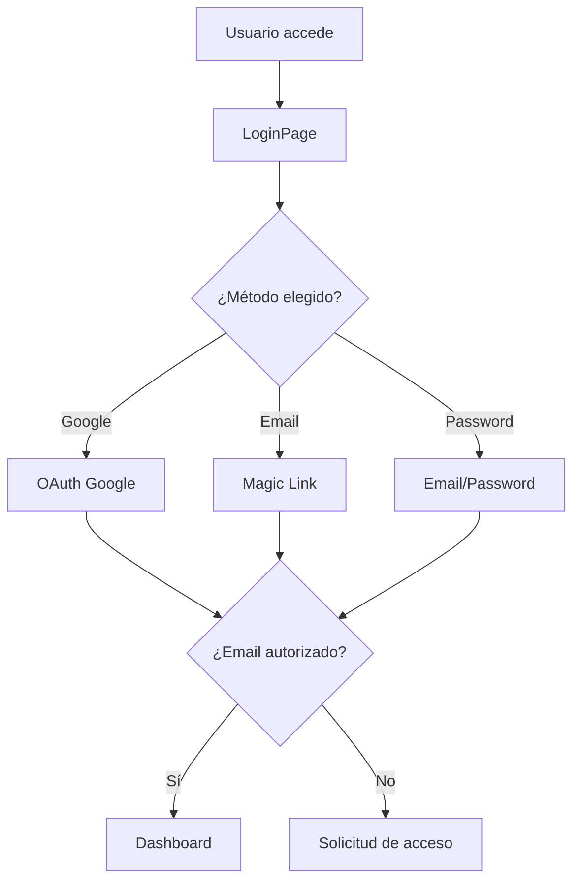

# 🔐 Sistema de Autenticación Multi-tenant

## Resumen

Implementación completa de autenticación para dirigentes scout con arquitectura multi-tenant, soportando múltiples grupos scout con acceso restringido por rol.

## 🎯 Características Implementadas

### ✅ Multi-Provider Authentication
- **Google OAuth** (Opción principal para dirigentes)
- **Magic Links** (Enlaces por email)
- **Email/Password** (Fallback tradicional)

### ✅ Multi-tenant Architecture
- **Row Level Security (RLS)** en PostgreSQL
- **Autorización por dirigente** con lista blanca
- **Roles jerárquicos**: `dirigente` < `grupo_admin` < `super_admin`

### ✅ UX Optimizado para Dirigentes
- **Flujo simplificado** con Google como principal opción
- **Magic Links** para dirigentes sin Google
- **Solicitudes de acceso** automáticas para no autorizados

## 📁 Archivos Implementados

```
src/
├── services/authService.ts              # 310 líneas - Servicio principal de autenticación
├── contexts/AuthContext.tsx             # 108 líneas - Context de React para estado global
├── pages/LoginPage.tsx                  # 400+ líneas - UI de login optimizada
├── components/
│   ├── ui/LoadingSpinner.tsx            # Componente de loading
│   └── Layout/ProtectedLayout.tsx       # Layout protegido con info de usuario
├── App.tsx                              # Aplicación principal con autenticación
database/
├── 02_authentication_system.sql        # 300+ líneas - Schema completo multi-tenant
docs/
└── GOOGLE_OAUTH_SETUP.md               # Guía completa de configuración OAuth
```

## 🚀 Estado de Implementación

### ✅ COMPLETADO
- [x] **AuthService** - Lógica completa de autenticación multi-provider
- [x] **AuthContext** - Estado global de React con hooks
- [x] **LoginPage** - UI completa con UX optimizada para dirigentes
- [x] **Database Schema** - Tablas, RLS, funciones de utilidad
- [x] **App Integration** - Flujo completo login → dashboard
- [x] **ProtectedLayout** - Layout con información del usuario autenticado

### 🔄 EN PROGRESO
- [ ] **Database Setup** - Ejecutar script SQL en Supabase
- [ ] **Google OAuth Config** - Configurar en Google Cloud + Supabase
- [ ] **Environment Variables** - Actualizar GitHub Secrets

### 📋 PENDIENTE
- [ ] **Testing** - Probar flujo completo de autenticación
- [ ] **Error Handling** - Mejorar manejo de errores
- [ ] **Admin Panel** - Panel para gestionar dirigentes autorizados

## 🔧 Configuración Requerida

### 1. Base de Datos
```bash
# Ejecutar en Supabase SQL Editor
./install-auth-system.sh
```

### 2. Google OAuth
Ver guía completa: [`docs/GOOGLE_OAUTH_SETUP.md`](./GOOGLE_OAUTH_SETUP.md)

### 3. Variables de Entorno
```env
# Agregar a GitHub Secrets
VITE_GOOGLE_CLIENT_ID=tu_google_client_id
VITE_AUTH_REDIRECT_URL=https://tuapp.azurestaticapps.net/dashboard
```

## 📊 Arquitectura

### Flujo de Autenticación


### Base de Datos Multi-tenant
```sql
-- Tabla principal de dirigentes autorizados
dirigentes_autorizados
├── email (único)
├── grupo_scout_id (FK)
├── role (dirigente|grupo_admin|super_admin)
└── activo (boolean)

-- RLS Policy Example
CREATE POLICY "user_access" ON scouts
USING (grupo_scout_id = obtener_grupo_usuario_actual());
```

## 🔒 Seguridad Implementada

### Row Level Security (RLS)
- **Dirigentes** solo ven datos de su grupo scout
- **Grupo Admins** pueden gestionar dirigentes de su grupo
- **Super Admins** tienen acceso completo

### Autorización
- **Lista blanca** de emails autorizados
- **Verificación automática** en cada login
- **Solicitudes de acceso** para no autorizados

## 💡 Patrones de Uso

### Hook de Autenticación
```typescript
function MyComponent() {
  const { user, loading, signOut } = useAuth();
  
  if (loading) return <LoadingSpinner />;
  if (!user) return <LoginPage />;
  
  return <div>Hola {user.name}</div>;
}
```

### Protección de Rutas
```typescript
// App.tsx maneja automáticamente la protección
function App() {
  return (
    <AuthProvider>
      <AppContent /> {/* Solo renderiza si está autenticado */}
    </AuthProvider>
  );
}
```

## 📈 Métricas de Código

| Archivo | Líneas | Propósito |
|---------|---------|-----------|
| `authService.ts` | 373 | Lógica de autenticación |
| `AuthContext.tsx` | 108 | Estado global React |
| `LoginPage.tsx` | 400+ | UI de login completa |
| `02_authentication_system.sql` | 300+ | Schema multi-tenant |

**Total: ~1,200 líneas** de código para autenticación completa

## 🎯 Próximos Pasos Inmediatos

1. **Configurar Google OAuth** siguiendo `docs/GOOGLE_OAUTH_SETUP.md`
2. **Ejecutar script de base de datos** con `./install-auth-system.sh`
3. **Agregar dirigentes autorizados** a la tabla `dirigentes_autorizados`
4. **Probar flujo completo** de autenticación

## 📞 Soporte

Para issues de configuración:
1. Verificar que las tablas estén creadas en Supabase
2. Confirmar configuración OAuth en Google Cloud Console
3. Validar variables de entorno en GitHub Secrets
4. Revisar logs de Supabase Auth para errores específicos

---

**Estado**: 🟡 Implementado, pendiente configuración OAuth y testing